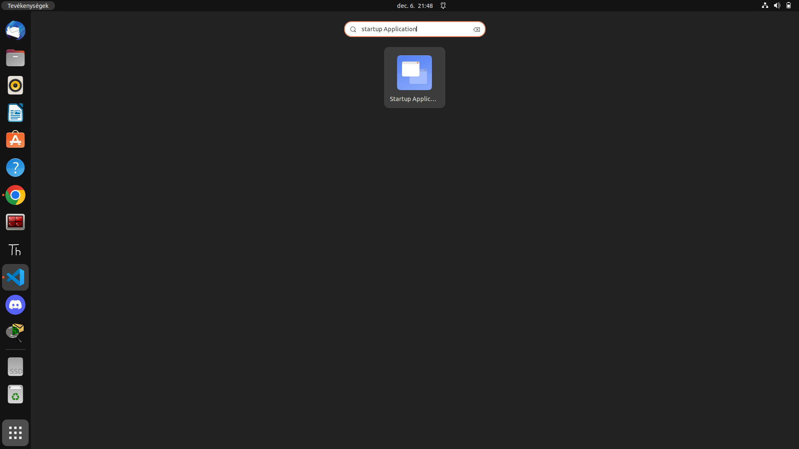
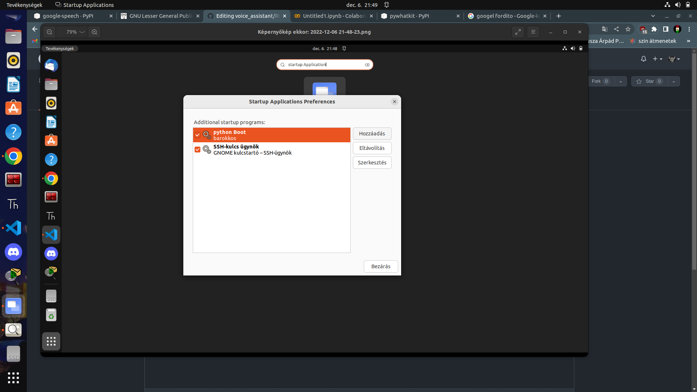
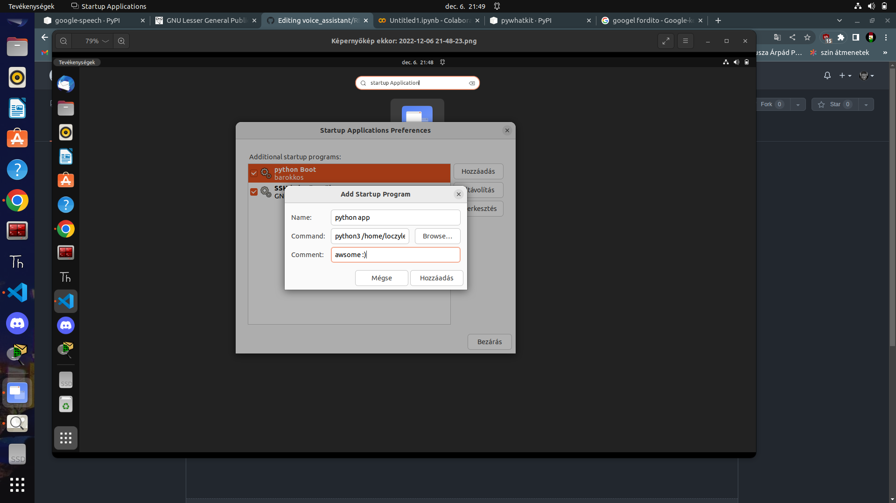

# python sript voice_assistant project

#### The project is very simple, after starting your PC, a machine voice announces the time and some more useful information

I use some python libaries here we come

* https://pypi.org/project/google-speech/

* time

* datetime

* https://pypi.org/project/pywhatkit/

if your pc is turn on the script is start run, but how can you do this?

## On Ubuntu/Linux

1. type here "*startup application*"

1. click startup application

1. Add new 

1. at the beginning write random name second __most important part in this tutorial__ you write a command line code for example: __python3 /here your python file path/__
2. for me: python3 /home/loczylevi/prog2/english_assistant.py 

1. click save

### Thats all! :)

if you restart your PC, your code will start after logging in

try it!

